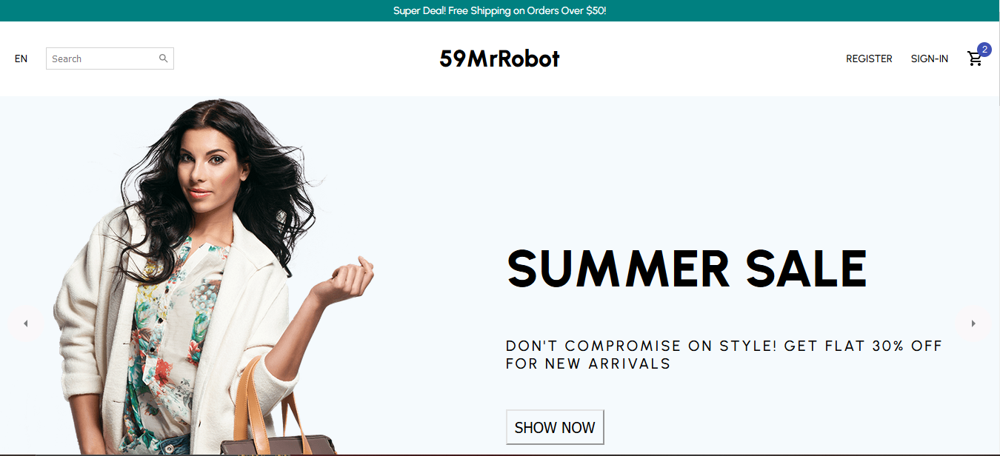
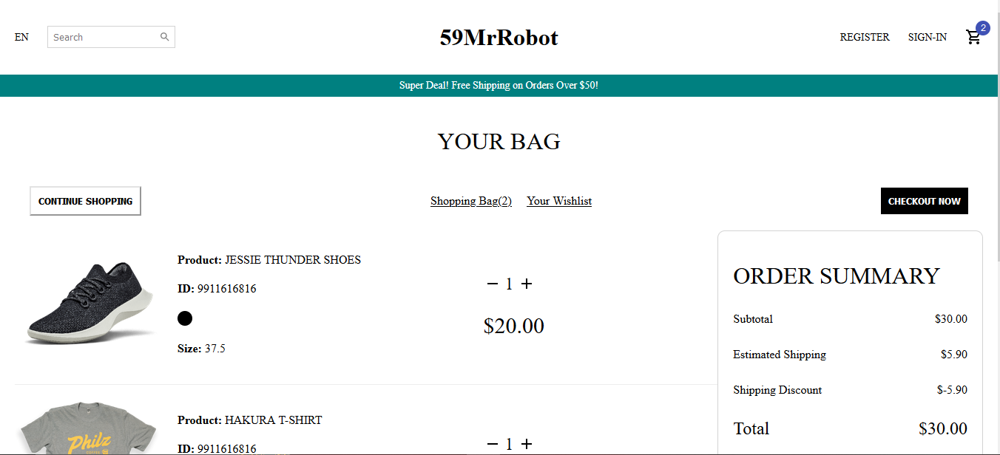
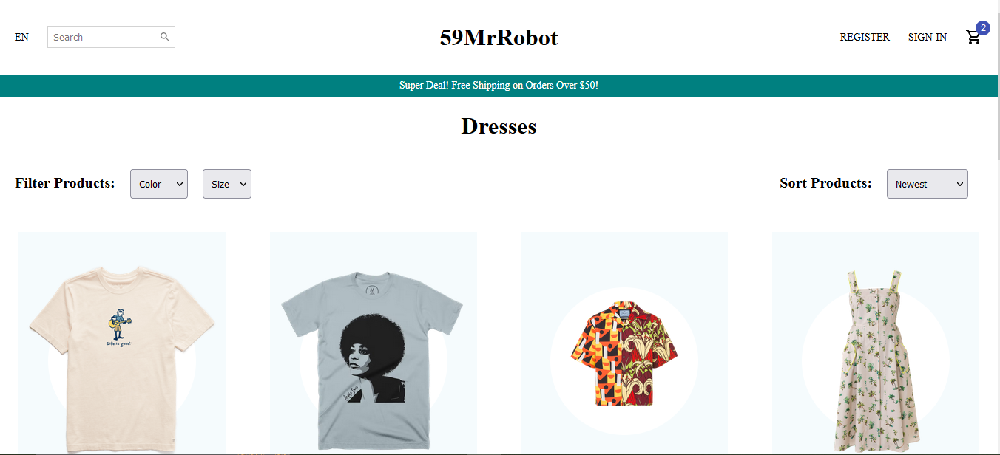
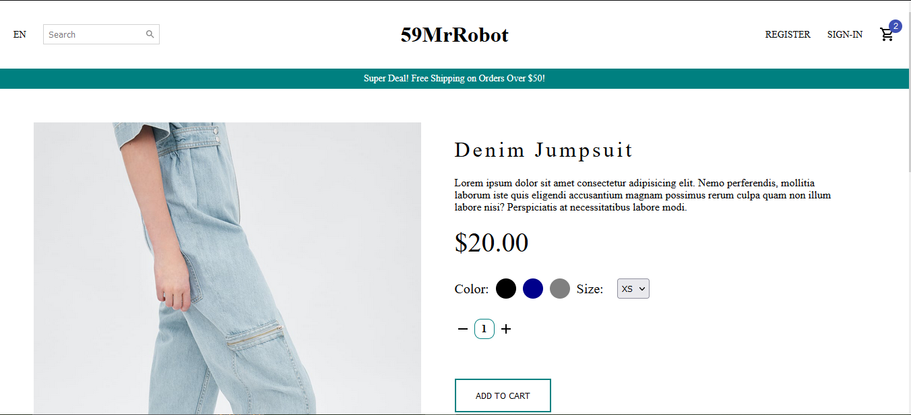
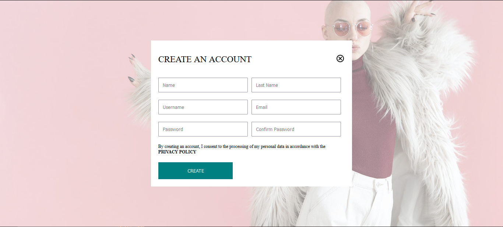
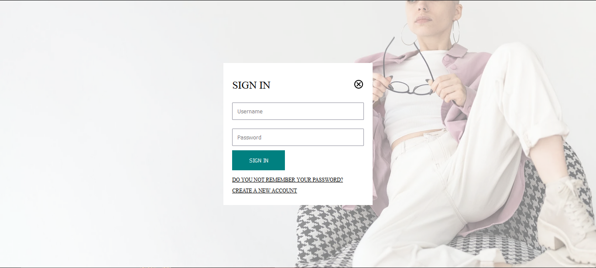

# Project Title

React E-Commerce Site

## Demo Link:

Access my site at https://59mrrobot.github.io/ecommerce-site/

## About The App:

I have built an e-commerce site..

## Screenshots:

## Technologies:

- React
- Typescript
- HTML
- Styled Components
- Material UI
- React Router

## Setup:

- Download or clone the repository.
- Install by running `npm install`.
- Start the server by running `npm start`.
- Visit the app at `http://localhost:3000/`.
